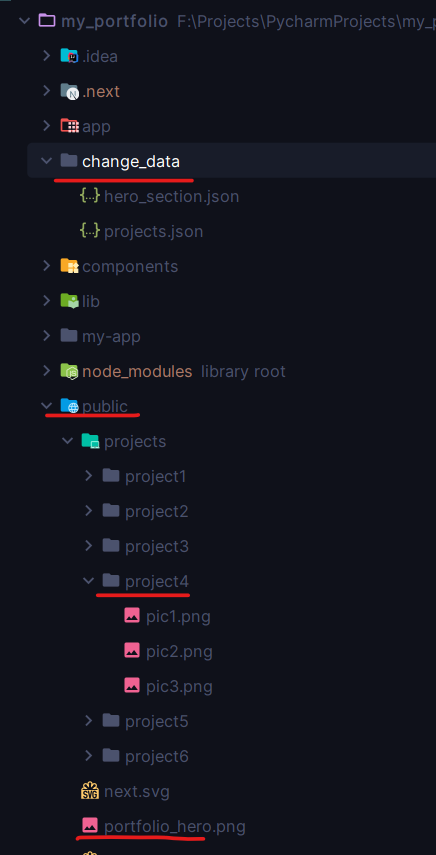

# My Portfolio

My Portfolio is an open-source project for creating personalized web portfolios. Download, edit, and upload to your domain 
with ease. Showcase your talents and achievements your way, you are welcome to use it :)

## Key Features

- **Personalized Portfolios:** Create customized web portfolios to showcase your talents and achievements.
- **Flexible Deployment:** Upload your portfolio to your domain effortlessly.
- **Responsive Design:** Ensure your portfolio looks great on all devices with responsive design.
- **Open Source:** Built on open-source technologies, making it easy to modify and adapt to your needs.

## Getting Started

To get started with My Portfolio, follow these steps:

**Clone the Repository:**
```bash
git clone https://github.com/dragon-devs/my-portfolio.git
```
Then go to: 
```bash
cd my-portfolio
```
Then go change_data directory where you can add you details.
```
cd change_data
```
There are 2 files one is `hero_section.json` where you will fill your details.
The other one is `projects.json` for projects details your previous that you want to showcase.
and add the projects images in the `public` directory there is another directory name `projects` then projects follow 
the sequence as it shown in the provided example.

**You can change the `portfolio_hero.png` add your picture for hero section (optional)**



**Edit and Customize:**

Customize the portfolio to your liking by editing the provided templates and content. after cloning:
```bash
npm install
```
Then run:
```bash
npm run dev
```
visit: [http://localhost:3000](http://localhost:3000)


**Deploy to Your Domain:**

Upload the customized portfolio to your domain or hosting provider :)

### Customize your theme:
go to `change_data` open the `theme.json`:
```bash
{
    "theme": "blue", // you can change this to any available color you want.
    "radius": "0.5rem" // change the value for radius of the elements as you want.
}
```
**Available Colors:**
```bash
    theme: "white" | "blue" | "red" | "rose" | "yellow" | "orange" | "green" | "purple",
```
select one of the provide colors then run:
```bash
npm run generate-theme
```
you will see the changes immediately. if not working [open an issue](https://github.com/dragon-devs/my-portfolio/issues).

### Experience Timeline:
inside the `change_data` directory there is a new file name `experience.json`
```bash
cd change_data
experience.json
```
now you can add your experience edit the file name: `experience.json` fill it with your data. save it.
## Contributing

Contributions are welcome! If you'd like to contribute to My Portfolio, please follow these guidelines:

- Fork the repository and create your branch from `main`.
- Make sure your code adheres to the established code style.
- Ensure your commits are descriptive and well-documented.
- Open a pull request, describing the changes you've made.

## License

My Portfolio is licensed under the [MIT License](LICENSE).

## Support

For support, bug reports, or feature requests, please [open an issue](https://github.com/dragon-devs/my-portfolio/issues).

## About

My Portfolio is developed and maintained by [dragon-devs](https://dragon-devs.vercel.app).